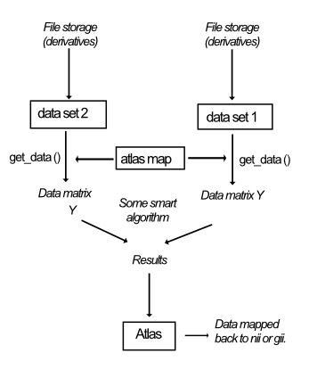

# Functional_Fusion
Diedrichsen Lab, Western University

This repository is the structure and preprocessing code for the multi-data set project in the Diedrichsenlab.

## Installation and dependencies
This project depends on several third party libraries, including:

[numpy](https://numpy.org/) (version>=1.22.2)

nibabel []

[nilearn](https://nilearn.github.io/stable/index.html) (version>=0.9.0), ...

	pip install numpy nilearn ...

[nitools]
    pip install neuroimagingtools

Or you can install the package manually from the original binary source as above links.

Once you clone the functional fusion repository, you need to add it to your PYTHONPATH, so you can import the functionality. Add these lines to your .bash_profile, .bash_rc .zsh_profile file... 

```
PYTHONPATH=<your_repo_absolute_path>:${PYTHONPATH}
export PYTHONPATH
```


## Structures of the project
### Overall structure


#### 1. Data Set class
As can be seen in above diagram, the integration across data sets is achieved through  `DataSet` objects, with each data set being an instantiation of that type. The `DataSet` has access to the subject list and the individual preprocessed imaging data. The main function of the Data set class is the  `get_data()` function, which provides the
processed data `Y` in desired format `(N * P)` where `N` is the number of measurements (tasks, etc) `P` is the number of brain locations for a specific subject.

### 2. Altas class
The Atlas class defines the group-atlas that the data is analyzed in. Subclasses are `AtlasVolumetric`, and `AtlasSurface`. The altases is in a specific space, but also has a mask that defines the `P` locations (vertices or voxels) that are being sampled for the analysis. Atlases are indicated by short strings that indicate the Atlas. You can get an atlas by calling `atlas_map.get_atlas(string)`. Defined altlasses so far:

* `SUIT3`:  Cerebellum in SUIT space (3mm voxels)
* `SUIT2`:  Cerebellum in SUIT space (2mm voxels)
* `SUIT1`:  Cerebellum in SUIT space (1mm voxels)
* `MNISymC3`: Cerebellum in MNI152NLin2009cSym space (3mm voxels)
* `MNISymC2`: Cerebellum in MNI152NLin2009cSym space (2mm voxels)
* `fs32k`: Left and Right hemisphere, using identical Medial wall mask 
* `fs32k_Asym`: Left and Right hemisphere, using asymmetric medial wall mask from HCP. 

### 2. Atlas map class
To read out different data sets into consistent anatomical locations, an `AtlasMap` object provides the mapping function from the data space to the common atlas space. The data space can be either the volumetric native space of the subject (`DataSetNative`), already predefined CIFTI files that contain surface data and Volume data (`DataSetCifti`), or the volumetric MNI space (`DataSetMNIVol`). 

## Directory structure for derivatives
=======
The Data Set class `DataSet` is designed to be the entry of getting the data in standard format. To be able to reuse a lot of the code across data sets, it is useful if the

### Derivatives structure

The folder structure of derivatives (example for DataSetNative)

    derivatives/
        │   README.md
        │
        └───group/
        │
        │       ...
        │
        └───sub-<label>/
                └───anat/
                │       sub-<id>_T1w.nii                             # Native space T1w (space defining)
                │       sub-<id>_label-CSF_probseg.nii               # probabilistic segmentation (CSF)
                │       sub-<id>_label-GM_probseg.nii                # probabilistic segmentation (GM)
                │       sub-<id>_label-WM_probseg.nii                # probabilistic segmentation (WM)
                │       sub-<id>_space-32k_hemi-L_white.surf.gii     # 32K white matter surface
                │       sub-<id>_space-32k_hemi-L_pial.surf.gii      # 32K pial surfaceces
                |       sub-<id>_desc-brain_mask.nii                 # Mask of within brain tissue
                └───suit/
                │       sub-<id>_label-GMc_probseg.nii                # probabilistic segmentation (GM-cereb)
                │       sub-<id>_label-WMc_probseg.nii                # probabilistic segmentation (WM-cereb)
                │       sub-<id>_label-GMb_probseg.nii                # probabilistic segmentation (GM-rest)
                │       sub-<id>_label-WMb_probseg.nii                # probabilistic segmentation (WM-rest)
                │       sub-<id>_desc-cereb_mask.nii                  # hand corrected cerebellar mask in functional space               
                |       sub-<id>_space-SUIT_xfm.nii                   # coordinate transformation file into native
                └───estimates/
        			└───ses-s1/
                            sub-<label>_ses-<label>_designmatrix.npy                    # Design matrix used for estimation
                            sub-<label>_ses-<label>_mask.nii                            # Brain mask in functional space
                            sub-<label>_ses-<label>_reginfo.tsv                         # Information on regression estimate values structure
                                                                                        # TSV-file with obligatory columns
                                                                                        #      run: run number (reflected in file name)
                                                                                        #      reg_id: regressor id (reflected in file name)
                                                                                        #      reg_num: column number of regressor in design matrix
                            sub-<label>_ses-<label>_resms.nii                           # Model Variance (ResMS.nii in SPM, sigmasquareds.nii.gz in FSL)
                            sub-<label>_ses-<label>_run-<label>_reg-<label>_beta.nii    # Parameter estimates (beta_0001.nii in SPM, pe1.nii.gz in FSL)


## Import data to the Functional Fusion framework
### Import Anatomical and MNI normalization parameters from SPM (Segement)
If you run the SPM Segmentation algorithm in a source directory, the anatomical, segmentations, and normalization parameters to MNI152Nonlin can be imported by: 
```
    import import_data as id
    source_dir = <Directory where you ran segementation (outside functional fusion) >
    dest_dir = '<base_dir/derivates/sub-xx/anat'
    anat_name = '<something>.nii' 
    id.import_anat(source_dir,dest_dir,anat_name,'sub-xx') 
```
### Import Cortical surfaces from Freesurfer reconstruction 
### Import SUIT normalization
Run SUIT isolation, and normalization outside of the Funtional Fusion framework. Additionally, you need to save the non-linear transformation between SUIT and individual subject space as a deformation file. 

```
    suit_save_darteldef(<c_anat_name>,'wdir',workingdirectory)
```
