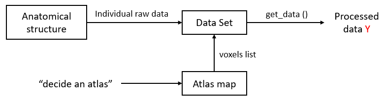

Functional_Fusion
====
Diedrichsen Lab, Western University

This repository is the structure and preprocessing code for the multi-data set project in the Diedrichsenlab. 

Installation and dependencies
------
This project depends on several third party libraries, including: 

[numpy](https://numpy.org/) (version>=1.22.2)

nibabel []

[nilearn](https://nilearn.github.io/stable/index.html) (version>=0.9.0), ...

	pip install numpy nilearn ...

Or you can install the package manually from the original binary source as above links.	

Structures of the project
------
### Overall structure

#### 1. Data Set class
As can be seen in above diagram, the integration across data sets is achieved through  `DataSet` objects, with each data set having an instantiation of a subclass. The `DataSet` has access to the subject list and the individual preprocessed imaging data. The main function of the Data set class is the  `get_data()` function, which provides the 
processed data `Y` in desired format `(N * P)` where `N` is the number of measurements (tasks, etc) `P` is the number of brain locations for a specific subject. 

### 2. Atlas map class

To read out different data sets in a consistent anatomical location, we need to
decide an `Atlas` to be used. For each subejct, we need to have an `AtlasMap`, which provides the mapping function from the raw data space (per subject) to the common atlas space. We will have subclasses `AtlasMapMNI`, `AtlasMapFS32K`, and `AtlasMapSUIT3`. For each subject (and hence Dataset), there will be a seperate Instantiation (Object) of this class. If two dataset share the same raw data space for the same subject, they can rely on the same AtlasMap. 

### 3. Altas
Each group atlas also has some subject / study independent behaviors that will be implemented in the `Atlas` Class. Subclasses indicates the brain areas to be studied with a structural template (i.e MNI 152).

## Directory structure for derivatives 
=======
The Data Set class `dataset` is designed to be the entry of getting the data in standard format. It 
reads the input of raw individual data and other parameters for further use. The class function 
`get_data()` is to get the final processed data matrix `Y` after minimally preprocessed data.

### Derivatives structure

The folder structure of derivatives

    @Ana: IMHO, all different individual derivatives should be under a ses-<label> dir, under sub<label> dir.
          I added this suggestion to the diagram.
      
    derivatives/
        │   README.md
        │
        └───group/
        │       
        │       ...
        │   
        └───sub001/
        │       └───ses-<label>/anatomical/
        │       │       file naming (@Caro)
        │       └───ses-<label>/func/
        │       │       file naming (@Ana)
        │       │
        │       │       Template suggested by BIDS:         
        │       │       sub-<label>[_ses-<label>]_task-<label>[_acq-<label>][_ce-<label>][_dir-<label>][_rec-<label>] \
        │       │           [_run-<index>][_echo-<index>]_<contrast_label>.nii[.gz]
        │       │
        │       │       [_acq-<label>][_ce-<label>][_dir-<label>][_rec-<label>] are optional keys/values.
        │       │       Multi-echo data MUST be split into one file per echo. We can this if not Multi-Echo.
        │       │
        │       │       Check: 
        │       │       https://bids-specification.readthedocs.io/en/v1.2.0/04-modality-specific-files/ \
        │       │           01-magnetic-resonance-imaging-data.html
        │       │
        │       │       Example for raw data after conversion from Dicom to NIfTI, considering a task named Theory-of-Mind (TOM):
        │       │       sub-01_ses-01_task-TOM_dir-ap_run-01_bold.nii.gz
        │       │         
        │       │       For preprocessed data, we should probably take advantage of the SPM prefixes. 
        │       │       I think we might be using data that need to be tagged with the following:
        │       │       a - slice timing correction
        │       │       r - resliced (this can be from coregistration or realignment)
        │       │       u - undistorted, (from Realign unwarp - which requires reslicing)
        │       │       w - warped - typically this is done by normalization
        │       │         
        │       │       Example:
        │       │       wurasub-01_ses-01_task-TOM_dir-ap_run-01_bold.nii.gz
        │       │
        │       │       Motion files should also be included here.
        │       │       Example:
        │       │       rpsub-01_ses-01_task-TOM_dir-ap_run-01_bold.txt
        │       │         
        │       │       Paradigm-descriptors files for all runs to build the design matrix should also be included here.
        │       │       Example:
        │       │       sub-01_ses-01_task-TOM_dir-ap_run-01_events.tsv
        │       │         
        │       └───ses-<label>/surface/
        │       │       sub-001_space-32k-L-.surf.gii ? (@Ladan)
        │       └───ses-<label>/suit/
        │               file naming (@Joern)
        │       └───contrast/
        │               @Ana: I think this dir should be renamed as 'first-level_analysis' because we may not only want 
        │                     to include contrast (stat) maps, but also effect size or effect variance maps.
        │                     Inside this dir, we should have sub-folders dedicated to each run and one for ffx, too.
        │               beta_info.tsv file structure (@Ana / @Ladan)
        │       ...
        │   
        └───sub002/
        │       ...
        │     
        └───subxxx/
                ...

### AtlasMap structure

Need to be discussed later.
