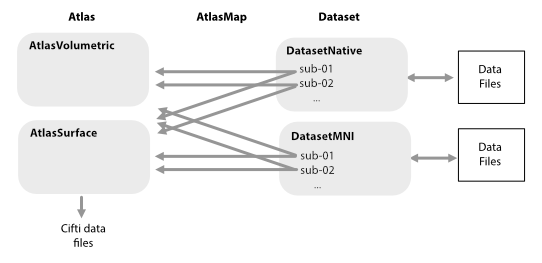

Overview
========

The Functional_Fusion repository is designed to bring data from many different fMRI experiments into a common analysis space - flexibly and efficiently.
Aggregating many smaller fMRI datasets will allow us to build better and bigger models of brain function.

Each dataset may be stored in different locations and in different format. Each dataset is managed via a ``DataSet`` object that knows where to find the data and how to load it. This allows the user to interact with each dataset in a uniform way.
We provide a number of common DataSet classes that assume that the data is stored following a BIDS-derivative structure.

The Analysis spaces (or regions of interest) are defined by an ``Atlas``. While we have predefined some common Atlases or regions, you can define your own. The framework supports both Volume- and Surface-based atlases. The mapping between each Atlas and each subject in each dataset is determined by an ``AtlasMap``, which allows you to *extract* the data from each subject without reslicing the images into a common space. This is especially useful if you want to get the time-series data for a specific region in the native space of the subject. Extracted data can be storted in CIFTI-files for further use, so you do not have to re-extract the data every time you want to use it.

There are three main steps to using this framework on new data:

* **Data Import**: Bringing the data into the common framework. This includes the import of the preprocessed time series or the contrast (beta) estimates. The data files are stored in the ``ffimport`` directory. A number of :ref:`datasets` are already imported and can be downloaded freely.
* **Data Extraction**: Pull the data in a specific atlas space, defined by an ``atlas``. The resulting CIFTI-file are by default stored in the ``ffextract`` directory for each dataset for quick retrieval.
* **Data Analysis**: After the data is extracted, you can simply load the data with ``dataset.get_data()``. which gives you a ``(nsubj x  nfeatures x voxel/vertices)`` tensor. You can then perform any analysis on this data. The repossitory provides a number of common analysis function for data aggregation and reliability estimation.
