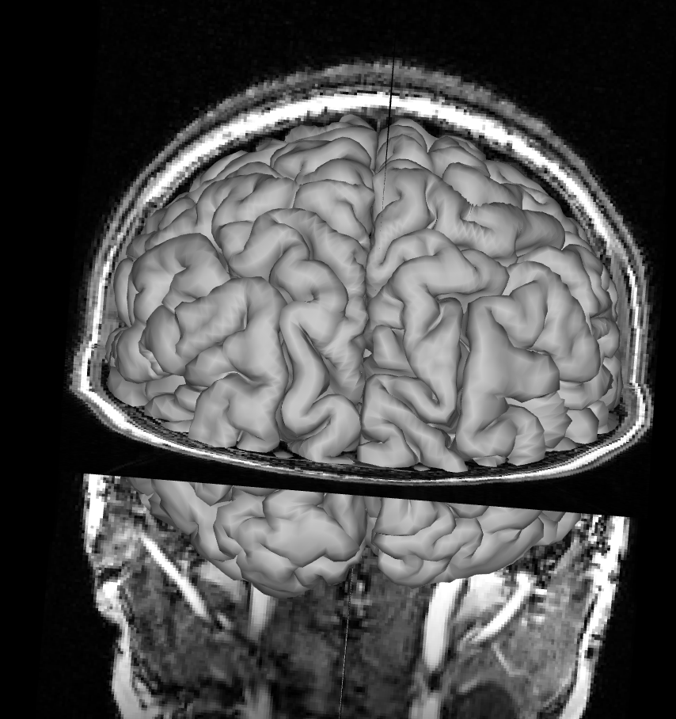

# Data Check
Diedrichsen Lab, Western University

Guide on how to check data quality.

## Surface checks
Surfaces are located in folder anat:

derivatives/
        └───sub-<label>/
        │       └───anat/
        │       │       sub-<id>_T1w.nii                # Native space T1w (space defining)
        │       │       sub-<id>_label-CSF_probseg.nii               # probabilistic segmentation (CSF)
        │       │       sub-<id>_label-GM_probseg.nii                # probabilistic segmentation (GM)
        │       │       sub-<id>_label-WM_probseg.nii                # probabilistic segmentation (WM)
        │       │       sub-<id>_space-32k_hemi-L_white.surf.gii     # 32K white matter surface
        │       │       sub-<id>_space-32k_hemi-L_pial.surf.gii      # 32K pial surfaceces
        |       |       sub-<id>_desc-brain_mask.nii                 # Mask of within brain tissue

To check that surfaces were reconstructed correctly and match the T1, pull up workbench:

```
wb_view
```

### Pial Surface

Open the native space T1 (sub-01_T1w.nii) and the pial surfaces for the left and right hemisphere (sub-01_space-32k_hemi-L_white.surf.gii & sub-01_space-32k_hemi-R_pial.surf.gii ). In the montage tab, click on ```All``` (is set to ```Montage``` by default). You might have to also click ```On``` for the T1 image in the overlay toolbox to show the T1.

You should now see the T1 image and reconstructed pial surface. Rotate the image to see whether the surface is aligned with the sulci in the T1. An extreme mismatch would look like this:

{width=50%}

A subtler mismatch of the right hemisphere could look like this:

{width=50%}

And here is a perfect match between pial surface and T1 image:

{width=50%}

### White Matter Surface

Remove the pial surface and add the white matter surface reconstruction. Make sure you removed the pial surface from you viewer, otherwise you won't see the white matter surface under the pial surface. Follow the same process as for the pial surface check, click on ```All``` and rotate the image to see how T1 and the white matter surface align. Mismatches for the white matter surface should be easy to spot since the white matter surface at the cortex should neatly fit into the grey matter on the T1 like below.

{width=50%}

Focus on the white matter sorface going into the coronal T1 slice, not the saggital slice. Since the white matter connects the hemispheres only at the corpus callosum, which is hidden behind the rest of the white matter in this view, it's hard to spot mismatches to the saggital T1 slice. Instead, look at where the white matter surface enters the coronal slice and the axial slice.


